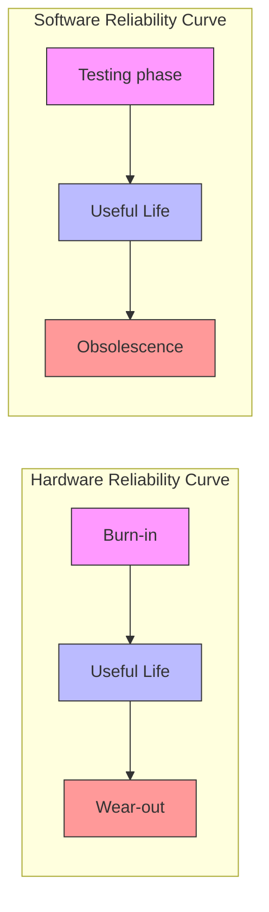
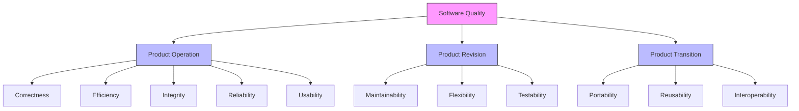

# Summary of Software Reliability and Quality

## 1. Basic Concepts of Software Reliability

Software reliability differs from hardware reliability because software doesn't physically wear out or break. The traditional "bath tub curve" of hardware reliability (with burn-in, useful life, and wear-out phases) isn't applicable to software.

Instead, software reliability follows a different curve:

- Testing phase: High failure rate initially that decreases with testing
- Useful life: Period of stable operation
- Obsolescence: Software becomes outdated due to changing requirements or technology

Software may become obsolete due to:

- Change in environment
- Change in infrastructure/technology
- Major change in requirements
- Increase in complexity
- Difficulty in maintenance
- Deterioration in code structure
- Slow execution speed
- Poor user interfaces

### Definition of Software Reliability

According to the text:

- "Software reliability means operational reliability" (Bev Littlewood)
- IEEE standard: "The ability of a program to perform its required functions under stated conditions for a specified period of time"
- "The probability of failure-free operation for a specified time in a specified environment" (Musa)

Example: A software with reliability of 0.95 for 10 hours would operate without failure for 95 out of 100 periods of that length.

## 2. Software Quality

Software quality is difficult to define precisely but generally encompasses how well a product meets its requirements and user expectations. The chapter organizes software quality into four main attribute domains:

1. Reliability
2. Usability
3. Maintainability
4. Adaptability

These domains are further broken down into more specific attributes.

### Software Quality Attributes

The chapter presents 20 quality attributes:

1. Reliability - Performance without failure
2. Correctness - Meeting specifications
3. Consistency and precision - Consistent results
4. Robustness - Tolerance for unexpected problems
5. Simplicity - Ease of operation
6. Traceability - Error tracking capability
7. Usability - Effort to learn and operate
8. Meeting specifications with precision
9. Clarity and accuracy of documentation
10. Conformity with operational environment
11. Specified functions
12. Computing resources required
13. Testing effort required
14. Maintainability - Ease of fixing errors
15. Modularity - Readability for understanding
16. Adaptability - Adaptable to different platforms
17. Modifiability - Effort to modify software
18. Expandability - Ability to expand without side effects
19. Portability - Effort to transfer between platforms
20. Several other factors (Integrity, Flexibility, Reusability, Interoperability)

### McCall's Quality Model

The chapter explains McCall's quality model which organizes quality factors into three categories:

![[Pasted image 20250401200126.png]]
1. Product Operation (factors related to operational performance)
    
    - Correctness
    - Efficiency
    - Integrity
    - Reliability
    - Usability
2. Product Revision (factors related to maintenance and testing)
    
    - Maintainability
    - Flexibility
    - Testability
3. Product Transition (factors related to transferring to different platforms)
    
    - Portability
    - Reusability
    - Interoperability

The model also includes 25 quality criteria (second-level attributes) that support the quality factors.

## 3. Capability Maturity Model (CMM)

The chapter discusses the Capability Maturity Model (CMM) developed by the Software Engineering Institute (SEI) of Carnegie-Mellon University. CMM is not a software lifecycle model but a strategy for improving software processes. It organizes software process maturity into five levels:

### Maturity Levels

1. **Initial (Level 1)**
    
    - No sound software engineering management practices
    - Ad hoc basis for projects
    - Success depends on individual competence
    - Most activities are responses to crises rather than planned tasks
    - Process is unpredictable and cannot be accurately estimated
2. **Repeatable (Level 2)**
    
    - Policies for managing software projects are established
    - Planning based on experience with similar projects
    - Basic software management controls in place
    - Process is characterized as practiced, documented, enforced, trained, and measured
    - Projects can repeat successful practices from earlier projects
3. **Defined (Level 3)**
    
    - Standard processes for developing and maintaining software are documented
    - Organization-wide training program implemented
    - Projects tailor the organization's standard software process
    - Process capability is "standard" and "consistent"
    - Cost, schedule, and functionality are under control
4. **Managed (Level 4)**
    
    - Detailed measures of software process and product quality are collected
    - Both software process and products are quantitatively understood and controlled
    - Process capability is "predictable"
    - Software products are of predictably high quality
5. **Optimizing (Level 5)**
    
    - Continuous process improvement is the focus
    - Organization can identify weaknesses and strengthen processes proactively
    - Defects are analyzed to determine their causes
    - Lessons learned are disseminated throughout the organization
    - Process capability is "continuously improving"

The text notes that advancing from one level to the next is challenging, with moving from level 1 to level 2 sometimes taking 3-5 years.

### Key Process Areas (KPAs)

Each maturity level (except level 1) includes key process areas that organizations should focus on:

#### Level 2 KPAs:

- Requirements Management (RM)
- Software Project Planning (SPP)
- Software Project Tracking and Oversight (SPTO)
- Software Subcontract Management (SSM)
- Software Quality Assurance (SQA)
- Software Configuration Management (SCM)

Example: For Requirements Management, the goal is to establish a common understanding between customers and developers about project requirements.

## Benefits of Software Reliability

The text highlights several benefits of focusing on software reliability:

1. It establishes a standardized, objective way to evaluate software quality
2. It allows evaluation of development progress during testing phases
3. It helps monitor operational performance and control new features and changes
4. It provides quantitative understanding of software quality factors

Example: A reliability objective can be used to determine when changes should be allowed in software. A freeze on changes not related to debugging might be imposed when failure intensity rises above performance objectives.

This comprehensive approach to software reliability and quality helps organizations produce better software in a more predictable manner, while continuously improving their processes.
